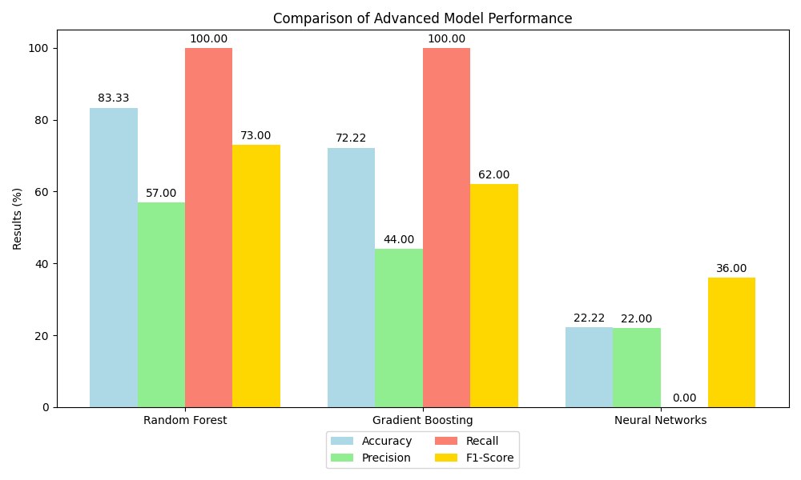

# Falcon 9 Landing Success Prediction 🚀

This project uses machine learning models to predict the success of Falcon 9 rocket landings based on factors such as payload mass, orbit type, and technical specifications.

## Table of Contents
- [Introduction](#introduction)
- [Features](#features)
- [Models Used](#models-used)
- [Results](#results)
- [Model Performance Comparison](#model-performance-comparison)
- [Falcon 9 Launch Simulation](#falcon-9-launch-simulation)
- [Future Work](#future-work)
- [License](#license)

## Introduction
Predicting the success of Falcon 9 rocket landings using various machine learning algorithms including Logistic Regression, Random Forest, Gradient Boosting, and Neural Networks. The dataset includes technical details about the rocket launches and uses the SMOTE technique to balance the dataset.

## Features
- Data preprocessing and feature engineering
- SMOTE applied for class balancing
- Multiple ML models implemented
- Visualizations of performance metrics
- Confusion matrix and classification reports

## Models Used
- Logistic Regression
- Random Forest
- Gradient Boosting
- Neural Networks

## Results

| Model                | Accuracy | Precision | Recall | F1-Score | Class 0 Precision | Class 0 Recall | Class 1 Precision | Class 1 Recall |
|----------------------|----------|-----------|--------|----------|-------------------|----------------|-------------------|----------------|
| Logistic Regression   | 88.89%   | 89%       | 89%    | 89%      | 75%               | 75%            | 93%               | 93%            |
| Random Forest         | 83.33%   | 90%       | 83%    | 85%      | 57%               | 100%           | 100%              | 79%            |
| Gradient Boosting     | 72.22%   | 88%       | 72%    | 75%      | 44%               | 100%           | 100%              | 64%            |
| Neural Networks       | 22.22%   | 83%       | 22%    | 18%      | 22%               | 100%           | 100%              | 0%             |

## Model Performance Comparison

Here is a comparison of the performance across different models (Random Forest, Gradient Boosting, and Neural Networks), highlighting metrics such as accuracy, precision, recall, and F1-Score.

## Falcon 9 Launch Simulation

This is a simulation of Falcon 9 rocket launches, showing the success, partial success, and failure outcomes based on risk factors such as payload mass and orbit type.

## Future Work

	•	Expanding the dataset with additional factors like weather conditions
	•	Fine-tuning hyperparameters for better performance
	•	Adding more complex neural networks to improve prediction

## License

This project is licensed under the [MIT License](LICENSE). Feel free to use, modify, and distribute the code as long as proper attribution is given.

